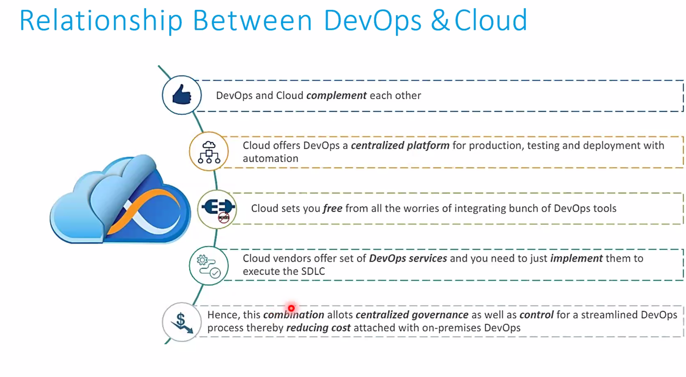
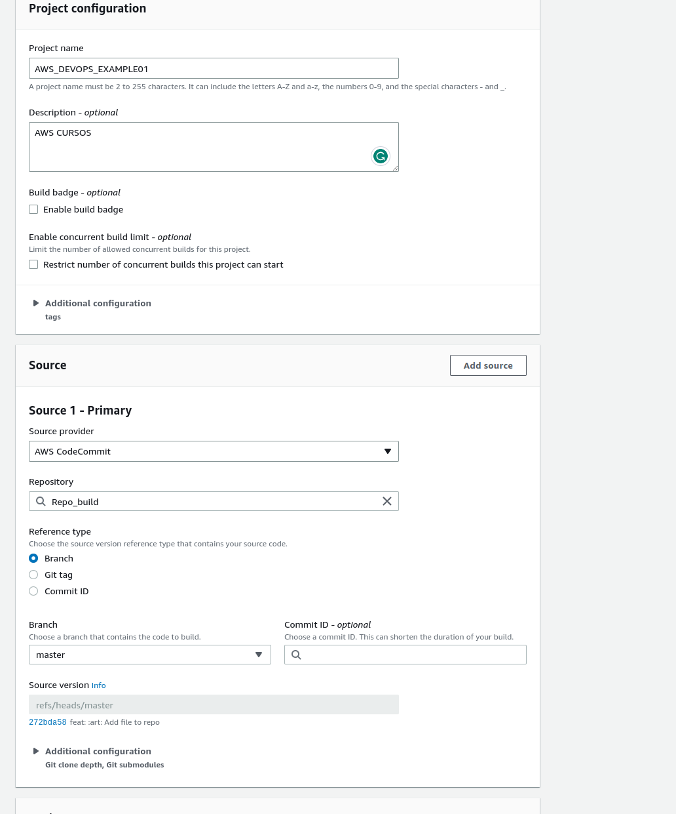
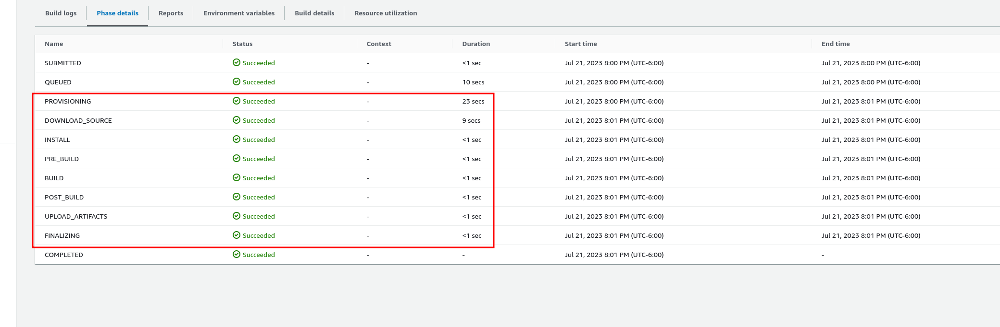
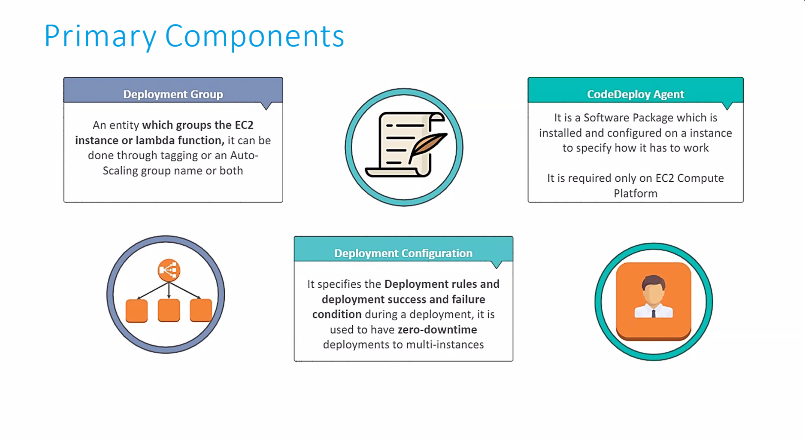
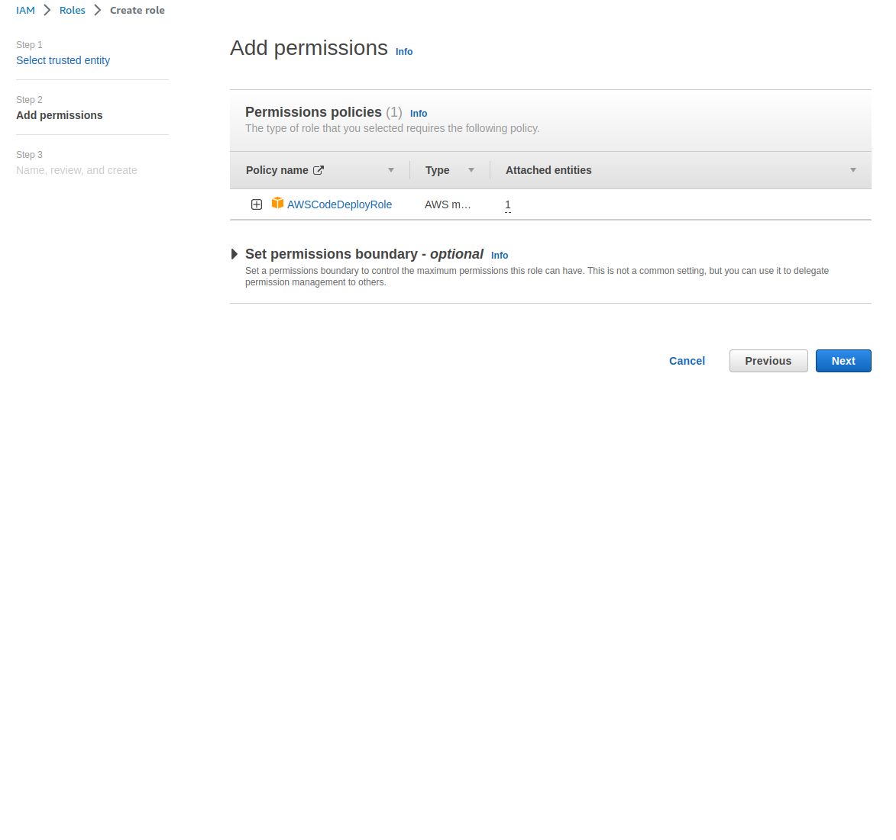
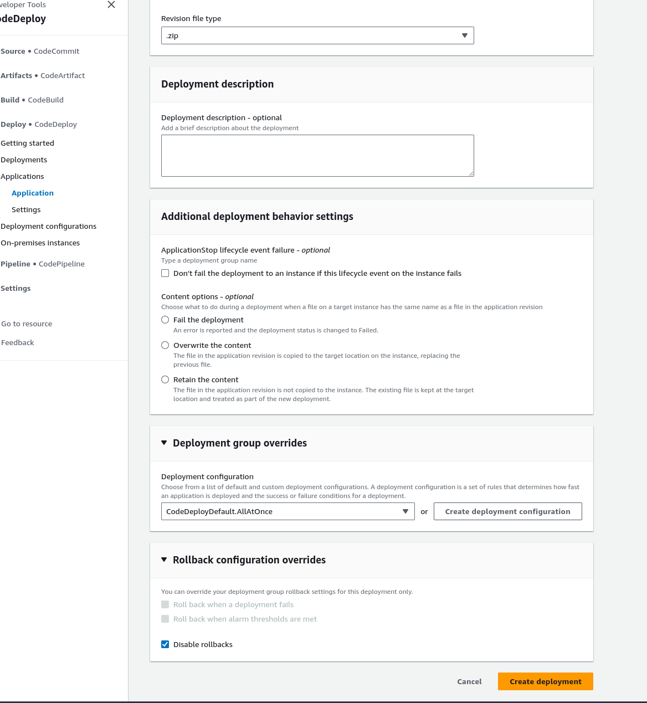
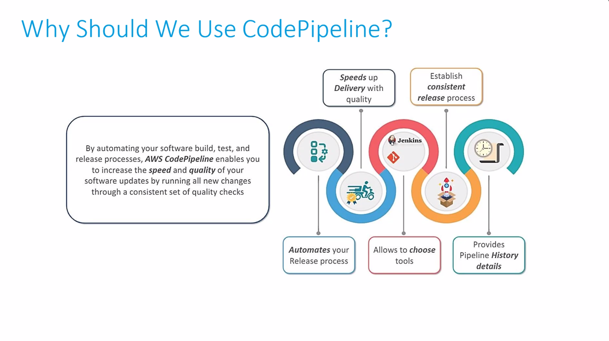
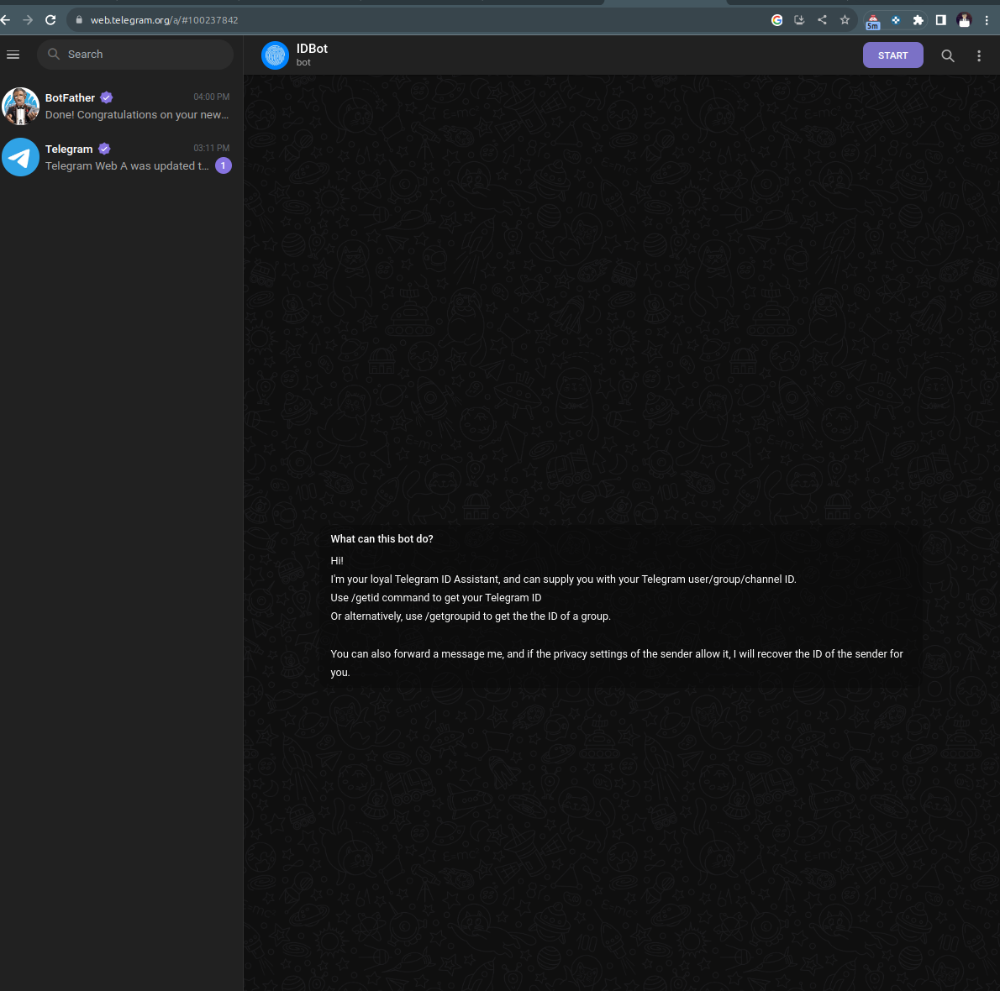

# Principle

## Curso de Introducción a AWS: Fundamentos de Cloud Computing

La computación en la nube es la entrega bajo demanda de recursos de IT como computación, almacenamiento y otros servicios a través de internet. En pocas palabras, es como si alquiláramos la computadora de otra persona.

Esta tecnología permite acceso instantáneo a los recursos que necesites, así como la adquisición del tipo y tamaño exacto de estos recursos. Algunos servicios que seguramente has usado son Gmail (proveedor de email), Dropbox (proveedor de almacenamiento) y Netflix (proveedor de video bajo demanda).

#### Modelos de computación en la nube

A continuación, conocerás las distintas plataformas en la nube que utilizamos cuando trabajamos en proyectos personales o en nuestra empresa.


- Nube pública
  La nube pública se refiere a los recursos de proveedores que utilizamos a través de internet y algunos ejemplos son Google Cloud Platform (GCP), Azure y AWS.

  Además, posee estas ventajas:

  Elimina los gastos de capital comercial (CapEx) y reduce el gasto operativo (OpEx).
  Reduce los precios en economías de escala
  Despliega aplicaciones a nivel global en cuestión de minutos

- Nube privada
  La nube privada es un servicio empleado por una organización que no está abierto al público. Permite un control total de la infraestructura y es útil para aplicaciones con requerimientos específicos de seguridad o comerciales.

  - Puede ser en la nube pero con de forma privada tal como Metal Servers(IBM) o AWS Outposts

- Nube híbrida
  La nube híbrida consiste en mantener nuestra infraestructura y extender sus capacidades mediante la nube pública. Posibilita el control sobre activos sensibles en tu infraestructura privada, aprovechando la flexibilidad y rentabilidad de la nube pública.

  

#### Características de la computación en la nube


Ahora que conoces los distintos modelos de tecnología en la nube, es importante que hablar sobre sus propiedades de computación.

- Este modelo genera un autoservicio en demanda (con registros en la plataforma ya se pueden proveer recursos)
- Tiene un amplio acceso a la red
- Proporciona un espacio donde los clientes pueden compartir infraestructura y recursos de manera segura
- Enables companies to consume a compuute resources, such as severs, storage or an applicatio, ad utility like wate or electricity, rather than having to build and maintain computing infraestructuresin house

- Cloud computing is the delivery of computing services: server, storage, databse, networking, tools, and software over the internet

#### Problemas resueltos por la nube

Por último, es crucial que conozcas las cualidades que trae implementar un sistema de computación en la nube.

- La nube aporta flexibilidad (puedes cambiar los tipos de recursos cuando sea necesario)
- Brinda rentabilidad y un servicio medido pues pagas solo por lo que usas
- Trae escalabilidad al agregar capacidad para hardware o equipos que necesitan acomodar cargas grandes
- Ofrece elasticidad al dar capacidad de escalar automáticamente cuando sea necesario
- Tiene alta disponibilidad y tolerancia a fallos
  Proporciona agilidad (puedes desarrollar, probar y ejecutar rápidamente aplicaciones en la nube)

## Los diferentes tipos de cómputo: IaaS vs. PaaS vs. SaaS

Estos modelos varían de acuerdo al tipo de servicio informático que pueda ofrecer, como servidores, almacenamiento, software o bases de datos.

#### Infrastructure as a Service (IAAS)

La infraestructura como servicio (IAAS) proporciona componentes básicos de IT en la nube, es decir, redes, computación, almacenamiento, etc. A su vez, provee el máximo nivel de flexibilidad para adaptarlo a tus necesidades.

Ejemplos: - Azure Virtual Machines - Linode - Digital ocean - S2 AWS - EC2 https://us-east-1.console.aws.amazon.com/ec2/home?region=us-east-1#AMICatalog:

#### Platform as a Service (PAAS)

Los modelos que ofrecen una plataforma como servicio (PAAS) eliminan la necesidad de que administremos la infraestructura y proveen una plataforma para gestionar aplicaciones.
Ejemplos:

- Heroku
- Google App Engine
- AWS Elastic Beanstalk

#### Software as a Service (SAAS)

El Software como servicio (SAAS) brinda un producto de software terminado que es ejecutado y administrado por el proveedor del servicio.

Ejemplos:

- Amazon Rekognition
- Dropbox
- Zoom
- Gmail

#### On -premises

On-premises se refiere a una forma tradicional de cómputo en la cual nos encargamos de gestionar nuestra propia infraestructura.

#### Responsabilidades según el tipo de cómputo

| Componente                               | On-premises | IAAS | PAAS | SAAS |
| ---------------------------------------- | ----------- | ---- | ---- | ---- |
| Aplicaciones                             | No          | No   | No   | Sí   |
| Data                                     | No          | No   | No   | Sí   |
| Runtime (Entonrno de ejecución como JRE) | No          | No   | Sí   | Sí   |
| Middleware                               | No          | No   | Sí   | Sí   |
| O/S                                      | No          | No   | Sí   | Sí   |
| Virtualización                           | No          | Sí   | Sí   | Sí   |
| Servidores                               | No          | Sí   | Sí   | Sí   |
| Almacenamiento                           | No          | Sí   | Sí   | Sí   |
| Redes                                    | No          | Sí   | Sí   | Sí   |

##### middleware

Middleware es software que se sitúa entre un sistema operativo y las aplicaciones que se ejecutan en él. Básicamente, funciona como una capa de traducción oculta para permitir la comunicación y la administración de datos en aplicaciones distribuidas. A veces, se le denomina “plumbing” (tuberías), porque conecta dos aplicaciones para que se puedan pasar fácilmente datos y bases de datos por una “canalización”.

##### middleware

Middleware es software que se sitúa entre un sistema operativo y las aplicaciones que se ejecutan en él. Básicamente, funciona como una capa de traducción oculta para permitir la comunicación y la administración de datos en aplicaciones distribuidas. A veces, se le denomina “plumbing” (tuberías), porque conecta dos aplicaciones para que se puedan pasar fácilmente datos y bases de datos por una “canalización”.

#### Línea del tiempo de AWS

Hace veinte años nació esta promesa tecnológica y en la actualidad ¡tiene clientes en más de 245 países y territorios!

- 2002 → Se lanza internamente la plataforma
- 2003 → Comienza a comercializarse la idea de AWS
- 2004 → Llega al público el servicio SQS
- 2006 → Vuelve a lanzarse al público SQS, S3 y EC2
- 2007 → Abren operaciones en Europa
- 2009 → Lanzan el servicio RDS (Relational Database)
- 2010 → Sale al mercado el servicio Route 53
- 2012 → Lanzan DynamoDB (una base de datos no relacional)

#### Una visión global: regiones y zonas de disponibilidad

La infraestructura de AWS está compuesta por regiones, zonas de disponibilidad, data centers y puntos de presencia. Además, se distribuye en diferentes regiones alrededor del mundo. Algunas de ellas son Ohio, Oregon, Norte de California, e incluso lugares exclusivos del gobierno de EE. UU. como GovCloud Este.

Si quieres conocer una lista completa con más sitios, puedes visitar esta https://aws.amazon.com/es/about-aws/global-infrastructure/?p=ngi&loc=0.

##### Cómo escoger una región de AWS

[Regions](https://aws.amazon.com/about-aws/global-infrastructure/regions_az/)

[Verify Service-Region Status](https://health.aws.amazon.com/phd/status)

Podemos escoger la región de nuestra aplicación basada en distintos aspectos que mencionaremos a continuación.

- El cumplimiento de los requisitos legales y de gobernanza de datos, pues los datos nunca abandonan una región sin su permiso explícito (Compliance)

- La proximidad con los clientes porque lanzan en una región cercana en donde estén para reducir latencia. Puedes revisar esta característica desde tu ubicación a cada región en cloudping.info.

- Costos por region, hay regiones más caras, podemos saber los gastos con [AWS Pricing calculator](https://calculator.aws/#/)

- Existen pares de región en caso de que una region falle puedo configurar otra, pero esto es muy distinto a las zonas de disponibilidad
  

> Los servicios disponibles dentro de una región debido a que muchos no funcionan en todas partes. Algunos servicios globales o regionales son…

##### Globales

- IAM
- Route 53
- Cloudfront
- WAF

##### Regionales

- EC2
- Beanstalk
- Lambda
- Rekognition

CLOUD PING test https://cloudpingtest.com/aws, https://www.cloudping.info/

[AWS Latency Test](https://www.awsspeedtest.com/latency)

## Configuration Budget in AWS

<https://console.aws.amazon.com/billing/home#/account>

### Laboratorio: crea tu cuenta en AWS


### Seguridad e identidad

Uno de los aspectos más importantes al trasladar aplicaciones en la nube es la seguridad. Es crucial que nuestros datos estén protegidos contra amenazas para así permitir que los usuarios accedan a nuestro sistema y encuentren solo los recursos que necesitan.

#### Servicios de protección de datos

A continuación, conocerás algunos servicios de protección de AWS y sus funciones para mover nuestras plataformas en la nube:

- Amazon Macie: descubre y protege datos sensibles
- **AWS Key Management Service: almacena y administra claves de cifrado**
- AWS CloudHSM: proporciona almacenamiento de claves basado en hardware
- AWS Certificate Manager: provee, administra e implementa certificados SSL/TLS
- **AWS Secrets Manager: traslada, gestiona y recupera datos (contraseñas, por ejemplo)**

#### Servicios de protección de la infraestructura

Es fundamental que cuides de la infraestructura de tu sitio web y AWS ofrece los siguientes servicios de seguridad:

- AWS Shield: protege contra ataques de Denegación de Servicio (DDOS)
- AWS Web Aplication Firewall (WAF): filtra el tráfico de sitios web maliciosos
- AWS Firewall Manager: administra las reglas del firewall de forma centralizada

#### Servicios de detección de amenazas

En todo momento nuestra plataforma está expuesta a grandes amenazas y por eso AWS desarrolló los siguientes servicios:

- Amazon GuarDuty: detecta automáticamente las amenazas
- Amazon Inspector: analiza la seguridad de la aplicación
- Amazon Config: registra y evalúa configuraciones de nuestros recursos
- Amazon CloudTrail: rastrea la actividad del usuario y el uso de las API que ocupamos en nuestra cuenta.

#### Servicios de gestión de identidad

Por último, existen distintas herramientas de gestión de identidad que provee AWS:

- AWS Identity and Access Management (IAM): administra de forma segura el acceso a una cuenta, servicios y recursos
- AWS Inicio de sesión único: implementa el inicio de sesión único (Single Sign On/SSO)
- Amazon Cognito: permite a los usuarios administrar la identidad dentro de las aplicaciones
- AWS Servicio de Directorio: implementa y administra un Active Directory service
- AWS Organizaciones: funciona para gobernar y administrar de distintas cuentas de AWS de forma centralizada

### IAM ilustrado

Identity and Access Management (IAM) es un servicio gratuito que nos ayuda a administrar los accesos a los servicios y recursos de tu cuenta en AWS. A su vez, puedes crear usuarios, grupos y establecer permisos de acceso a los recursos mediante el uso de políticas.

#### Usuarios y grupos de usuarios de IAM

Los usuarios y grupos de usuarios son de los principales componentes de IAM. Al crear tu cuenta de AWS te proporcionan un usuario Root que tiene acceso a todos los recursos,

Este usuario puede generar otros perfiles y cada uno con un acceso único a distintos recursos de AWS. Además, Root también puede configurar grupos de usuarios, donde cada miembro tiene y puede compartir permisos de acceso.

##### Ejemplos de políticas de IAM

También está este ejemplo de políticas de acceso a un bucket de S3 (almacenamiento)

```bash
{
    "Version": "2012-10-17",
    "Statement": [
        {
            "Effect": "Allow",
            "Action": [
                "s3:ListBucket"
            ],
            "Resource": "arn:aws:53 ::: bucket-name"
        },
        {
            "Effect": "Allow",
            "Action": [
                "s3: GetObject",
                "s3: PutObject",
            ],
            "Resource": "arn:aws:53 ::: bucket-name /*"
        }
    ]
}

```

#### IAM Roles

Además de todas estas funciones, IAM de AWS permite asumir roles y otorgar permisos a otras tecnologías. Por ejemplo, podemos conceder a una máquina virtual el acceso a una base de datos mediante un rol de IAM.

### Secrets Manager

Secrets Manager es un servicio de AWS que nos ayuda a proteger los datos secretos (contraseñas, claves y tokens) necesarios para acceder a nuestras aplicaciones, servicios y recursos.

También nos permite compartir automáticamente esta información cuando queramos. Además, este servicio evita que tengamos que copiar y pegar los secretos directamente en nuestro código.

- Servicio simple que nos ayuda a proteger los secretos que son necesarios para acceder a sus aplicaciones, servicio y recursos.
- Rotar automáticamente
- Los secretos pueden ser contraseñas, claves y tokens

```
import mysql.connector
connection = mysql.connector.connect(
host="localhost",
database="mydb",
user="root",
password=get_secret_value['SecretString']
)
```

También nos permite compartir automáticamente esta información cuando queramos. Además, este servicio evita que tengamos que copiar y pegar los secretos directamente en nuestro código. `
También nos permite compartir automáticamente esta información cuando queramos. Además, este servicio evita que tengamos que copiar y pegar los secretos directamente en nuestro código.

## EC2 (IaaS)

Elastic computing cloud

- Virtualización:
  - Es la creación a través de software de una representación (virtual) de algún recurso tecnológico como un servidor.
- Almacenamiento EBS:
  - ELASTIC BLOCK STORE, proporciona volúmenes de almacenamiento de nivel de bloque para su uso con instancias de EC2. (Difícil de escalar). dispositivo que puedes montarse en EC2 (solo una instancia EC2 puede acceder EBS).
- Auto Scalling ASG:
  - Un grupo de Amazon EC2 Auto Scaling (ASG) contiene un conjunto de instancias EC2 que comparten características similares y se tratan como una agrupación lógica para fines de administración de flotas y escalado dinámico.
- Distribución de Carga entre maquinas ELB:
  - Elastic Load Balancing (ELB) distribuye automáticamente el tráfico de aplicaciones entrantes entre varios destinos y dispositivos virtuales en una o varias zonas de disponibilidad (AZ).

## Script to create instance

```bash
#!/bin/bash

# Use this for your user data (script from top to bottom)

# install httpd (Linux 2 version)

yum update -y

yum install -y httpd

systemctl start httpd

systemctl enable httpd

echo "<h1>Hello World from $(hostname -f)</h1>" > /var/www/html/index.html
```

- Elactic IP

> Es posible que pidas en AWS una IP que no cambie si tú apagas o reinicias tu máquina. Esto es fundamental si quieres asociar dominios a tu servidor.
> Elastic IP y le puedes decir que te mantenga esa IP asignada a la instancia. Lo encuentra en la parte de network and security en el menu lateral izquierdo.

---

# Security

## EC2 instance types

- General Purpose:

  - Para proyectos como paginas web o repositorios de código.

- Compute Optimized:

- Carga de trabajo de procesamiento por lotes
- Transcodificación de medios
- Servidores web de alto rendimiento
- Informática de alto rendimiento (HPC)
- Modelado científico y Machine Learning
- Servidores de Juegos dedicados

- Memory Optimized:

  - Bases de datos
  - Cache Distribuido
  - Aplicaciones BI
  - Aplicaciones para procesamiento en tiempo real

- Storage optimized:
  - Procesamiento de transacciones (OLTP)
  - Bases de datos relaciones y NoSQL
  - Redis (Cache DB en memoria)
  - Almacenamiento de datos

## Security groups y ports

- Grupos de Seguridad:
  - Fundamentales para la seguridad.
  - Reglas de permisos para trafico entrante/saliente (firewall)
  - No es software, es un componente que se adjunta a las intancias EC2.
  - Puedes referenciar grupos de seguridad entre si.
- Puertos Clásicos:
  - 21 ftp
  - 22 SSH
  - 22 sftp
  - 80 http
  - 443 https
  - 3389 RDP

### Connect to aws by ssh

SSH Es un protocolo de administracion remota que permite conectarnos a los usuarios y controlar remotamente los servidores

##### Generate an SSH Key Pair on UNIX and UNIX-Like Systems

```bash
ssh-keygen -b 2048 -t rsa
```

- You can show your public ssh with

```
cat /home/user/.ssh/id_rsa.pub
```

- Open an SSH client.

Locate your private key file. The key used to launch this instance is my remote key.pem

- Run this command, if necessary, to ensure your key is not publicly viewable.
  chmod 400 my remote key.pem (sudo)

- Connect to your instance using its Public DNS:
  ec2-13-57-41-170.us-west-1.compute.amazonaws.com

- Example: (sudo)
  `ssh -i "my remote key.pem" ec2-user@ec2-13-57-41-170.us-west-1.compute.amazonaws.com`

### Default Linux system user account

.

- For Amazon Linux 2\*\* or the Amazon Linux AMI, the user name is ec2-user.
- For a CentOS AMI, the user name is centos or ec2-user.
- For a Debian AMI, the user name is admin.
- For a Fedora AMI, the user name is fedora or ec2-user.
- For a RHEL AMI, the user name is ec2-user or root.
- For a SUSE AMI, the user name is ec2-user or root.
- For an Ubuntu AMI, the user name is ubuntu.
- For an Oracle AMI, the user name is ec2-user.
- For a Bitnami AMI, the user name is bitnami.

Otherwise, check with the AMI provider. <https://docs.aws.amazon.com/AWSEC2/latest/UserGuide/managing-users.html>

---

# administración

### Lab: EC2 Instance Roles

- Se requiere listar los usuarios desde la maquina de EC2. Sin embargo es mala practica agregar las (key) a la instancia de EC2 para realizar esta acción.
- Por tal motivo se crea un rol, el cual tiene la política de consultar los usuarios de la cuenta.
- Este rol se le asigna a la instancia EC2 y así poder consultar los usuarios desde EC2.

## Opciones de compra de instancias

Modelo de precios

Instancias bajo demanda:

- Pago por uso (facturación por segundos)
- Costos más altos.
- Flexibilidad para apagar en cualquier momento.
- Recomendado para cargar interrumpidas, no se sabe como se comportara.

Instancias reservadas

- Se puede reservar entre 1 a 3 años.
- Descuentos de hasta 72%
- Recomandadas para uso estable como DB.
- tienen 2 modelos:
- Convertible;
- Se puede cambiar el tipo de instancia cuando lo necesitemos, hasta 45% descuento.
- Programadas:
- Lanzamiento programado (ejm: black friday)

Instancias Spot

- no recomendable para ambientes de producción

Host Dedicados

- Servidor fisico, capacidad de instancia s2.
- Se puede traer sus propias licencias, instalarlo en el host.
- se puede reservar hasta 3 años.

Instancias dedicadas:

- Se ejecutaran en HW dedicado
- Se puede compartir el HW para compartirlo con otras instancias dentro de la cuenta…

## Modelo de responsabilidad compartida para EC2

### AWS

- Infraestructure(network)
- Aislamiento en host fisicos
- Validación de cumplimiento
- Remplazo de hardware defectuoso

### You

- Reglas de grupos de seguridad
- Patchs and updated of the OS
- Software and utilities on EC2 instances
- IAM functions assigned to users EC2-IAM
  Más información sobre el Shared Responsibility Model <https://aws.amazon.com/compliance/shared-responsibility-model/>

## CLOUDWATCH to create an alarm

GO to CLOUDWATCH> Alarm > Bills to create an alarm

Then to create an

## Create alarm for services

Account>Cost management

## SNS Envio de correos/notificaciones

## ARN AMAZON RESOURCE NAME

# Introduction to DEVOPS


- Lifecycle Plan: Jira, trello
- Lifecycle Code: Git, gitlab, github, bitbucket
- Lifecycle Build: Maven, Docker, Gradle
- Lifecycle Test: Sonnaq, Junit, Selenium, Jest, Postman, Swagger - Reducir los riesgos asociados
- Lifecycle Release: TraviS ci, bamboo, jenkins, gitlab, github
- Lifecycle Deploy: IaaS (TERRAFORM)- AWS puppet kubernetes, ansible, google cloud platform
- Lifecycle Operate: Puppet, AWS, google cloud platform, Azure
- Lifecycle Monitor: Puppet, AWS, google cloud platform, Azure

## Devops Model


- It's quickly, easily, repeatedly and safely moves the software from Developers infrastructure to production infrastructure
- DevOPs Solve drawbacks of both waterfall and agile process


- No es necesarios tener encendido los ambientes de DEV y QA, siempre
- Se deben crear caracteristicas para autodestrucción

## Overview of all three model


GIT FLOW




Se parte apartir del codigo con, AWS codecommit posteriormente, se realiza el build con AWS Code Build, con codePipelines es el orquestador como Jenkins, testing es una herramienta de terceros, para hacer un release se debe usar codedeploy

cloudtrail
couldformation
opsworks

## Connect AWS por CLI

Open an SSH client.

Locate your private key file. The key used to launch this instance is ubuntu_2023.pem

Run this command, if necessary, to ensure your key is not publicly viewable.
chmod 400 ubuntu_2023.pem

Connect to your instance using its Public DNS:
ec2-3-84-232-46.compute-1.amazonaws.com

Example:

ssh -i "ubuntu_2023.pem" ubuntu@ec2-3-84-232-46.compute-1.amazonaws.com

## Install AWS CLI

[aws](https://docs.aws.amazon.com/cli/latest/userguide/getting-started-install.html)

Code for ubuntu
`curl "https://awscli.amazonaws.com/awscli-exe-linux-x86_64.zip" -o "awscliv2.zip"
unzip awscliv2.zip
sudo ./aws/install`

NOw you can run
`/usr/local/bin/aws --version`

COnnect IAM

`aws s3 ls`

Clone repo

`git clone https://github.com/aws-samples/aws-nodejs-sample`

Install node
`

# install Volta

curl https://get.volta.sh | bash

# install Node

volta install node

# start using Node

node
`Execute` npm i`Execute` node sample`

## Create Permissions

```
{
    "Version": "2012-10-17",
    "Statement": [
        {
            "Effect": "Allow",
            "Action": "*",
            "Resource": "*"
        }
    ]
}
```

- Efect Block, Allow
- Action Show, Edit
- - Todo

### Generate policy

https://awspolicygen.s3.amazonaws.com/policygen.html

### Allow Simulate policy

https://docs.aws.amazon.com/es_es/IAM/latest/UserGuide/access_policies_testing-policies.html

### Create Policy

https://us-east-1.console.aws.amazon.com/iamv2/home?region=us-west-1#/policies

## Crear AWS IAM Alias to Login

https://aws-devops-ramirex.signin.aws.amazon.com/console


## CI/CD Pipe line


### Code Commit


### Get stared


- Create repo CodeCommit Developer Tools > CodeCommit > Repositories
- Connection steps with HTTP

Create Git credentials for your IAM user, if you do not already have them. Download the credentials and save them in a secure location. [Generate Git Credentials](https://us-east-1.console.aws.amazon.com/iamv2/home?region=us-east-1#/users/details/felipe_admin?section=security_credentials) - IAM > USER > Security crendetial > HTTP Credential for Code commit - Save the csv

## FAQ

https://aws.amazon.com/codecommit/faqs/

### CodeCOmmit trigger


## AWS Code Build

https://aws.amazon.com/codebuild/?nc=sn&loc=0




### Se cobra en todas las fases pero las más pesadas están en

- INSTALL
- PRE_BUILD
- BUILD
- POST_BUILD
- UPLOAD_ARTIFACTS



### Build from S3 to S3


###



## App spec


## App spec


## CODE DEPLOY Y EC2

- Se deben crear permisos y roles
  [ROLES PAGES](https://us-east-1.console.aws.amazon.com/iamv2/home?region=us-west-1#/roles)
  - EC2 CONNECT TO CODE DEPLOY [AmazonEC2RoleforAWSCodeDeploy](https://us-east-1.console.aws.amazon.com/iamv2/home?region=us-west-1#/roles/create?commonUseCase=EC2&step=addPermission&trustedEntityType=AWS_SERVICE)
    - 
    - 
  - Create EC2 (allow HTTP AND HTTPS)
  - 
  - 
  - ## Update System
    - `sudo yum update -y`
    - `sudo yum install -y ruby wget`
  - ## [Code deploy agent for Linux](https://gist.github.com/rfajarachmad/c45386829fbdd8a7ae6b40cb47fc1111)


      ```

wget https://{bucket-name}.s3.amazonaws.com/latest/install
chmod +x ./install
sudo ./install auto

## bucket-name represents one of the following:

## aws-codedeploy-us-east-1 for instances in the US East (N. Virginia) region

## aws-codedeploy-us-west-1 for instances in the US West (N. California) region

## aws-codedeploy-us-west-2 for instances in the US West (Oregon) region

## aws-codedeploy-eu-west-1 for instances in the EU (Ireland) region

## aws-codedeploy-eu-central-1 for instances in the EU (Frankfurt) region

## aws-codedeploy-ap-northeast-1 for instances in the Asia Pacific (Tokyo) region

## aws-codedeploy-ap-southeast-1 for instances in the Asia Pacific (Singapore) region

## aws-codedeploy-ap-southeast-2 for instances in the Asia Pacific (Sydney) region

## aws-codedeploy-sa-east-1 for instances in the South America (São Paulo) region

sudo service codedeploy-agent status
```    - Example`wget https://aws-codedeploy-us-east-1.s3.us-east-1.amazonaws.com/latest/install` - `chmod +x ./install` - `sudo ./install auto` - `sudo service codedeploy-agent status`

- ## Create role for codeDeploy
  
  
- ## Crete codedeploy
  
  
- Create group
  - 
  - 
  - 
- [Settings](https://docs.aws.amazon.com/codedeploy/latest/userguide/deployment-configurations.html)
- Extract app.zip this is the configuration of the app
- Connect to CLI
- Create Bucker `aws s3 mb s3://buckerdeploycode2`
- VERSIONING BUCKET `aws s3api put-bucket-versioning --bucket buckerdeploycode --versioning-configuration Status=Enabled`
- When you are on the app folder
  `aws deploy push --application-name codedeploy --s3-location s3://buckerdeploycode/codedeploy-demo/app.zip --ignore-hidden-files`








## Create code pipelines


-- repeate CODE DEPLOY Y EC2


https://aws.amazon.com/es/blogs/devops/integrating-sonarcloud-with-aws-codepipeline-using-aws-codebuild/

## code star


## ECR PUSH DOCKER

```
FROM php:8.0-apache
WORKDIR /var/www/html/
RUN docker-php-ext-install mysqli && docker-php-ext-enable mysqli
RUN apt-get update && apt-get upgrade -y
COPY . .
EXPOSE 80
EXPOSE 3306


```


## ECS DOCKERS


### Create task

## Clould9


### Create COULD
https://us-east-1.console.aws.amazon.com/cloud9control/home?region=us-east-1#/


### eXECUTE ON TERMINAL (download)
`aws s3 sync s3://bigdata-files-lab-2022/Collection .`
https://docs.aws.amazon.com/IAM/latest/UserGuide/access_policies.html 
### Invoque via clud formation s3
`aws cloudformation create-stack --stack-name StackCFS3 --template-body file://s3.yaml`

### Update s3
- Change S3
aws cloudformation create-stack --stack-name StackCFS3 --template-body file://s3.yaml

### DELETE  s3
- Change S3
aws cloudformation delete-stack --stack-name StackCFS3

### Invoque via clud formation dynamoDB
`aws cloudformation create-stack --stack-name StackCFDynamo --template-body file://dynamodb.yaml`

### Remove dynamo
`aws cloudformation create-stack --stack-name StackCFDynamo --template-body file://dynamodb.yaml`


### Create visual S3


### AWS WELL Infraestructure
https://aws.amazon.com/es/architecture/?wasn_achp1&cards-all.sort-by=item.additionalFields.sortDate&cards-all.sort-order=desc&awsf.content-type=*all&awsf.methodology=*all&awsf.tech-category=tech-category%23databases&awsf.industries=*all&awsf.business-category=*all


## LAMBDA COULD (crear bot)

`aws cloudformation create-stack --stack-name StackCFDynamo --template-body file://dynamodb.yaml`
### Telegram

## aws0729222_bot
### get my id 
`/start`

`/getid`


### create service
`aws cloudformation create-stack --stack-name StackLambda --template-body file://Lambda.yaml --capabilities CAPABILITY_NAMED_IAM`


- verify email
### start tel;egram


### INSTALL Y EXECUTE
`pip install boto3 --user`

`python3 WriteKinesisProduct.py`

### remove
`aws cloudformation delete-stack --stack-name StackLambda`


## Terraform
https://www.terraform.io/

### Install terraform
```
sudo apt update
sudo apt install  software-properties-common gnupg2 curl
```
```
curl https://apt.releases.hashicorp.com/gpg | gpg --dearmor > hashicorp.gpg
sudo install -o root -g root -m 644 hashicorp.gpg /etc/apt/trusted.gpg.d/
```
```
sudo apt-add-repository "deb [arch=$(dpkg --print-architecture)] https://apt.releases.hashicorp.com $(lsb_release -cs) main"

```
```
sudo apt install terraform
```
```
terraform --version
```


### Create main.tf

```tf
resource "aws_s3_bucket" "bucket" {
  bucket = "buckettstd202307292"

  tags = {
    Name        = "My bucket"
    Environment = "Dev"
  }
}
resource "aws_codecommit_repository" "test" {
  repository_name = "repositorioterraform20230729"
  description     = "This is the Sample App Repository"
}

```

### Execute command
- init
- validate
- plan
- apply
